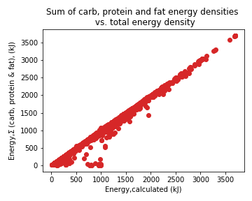
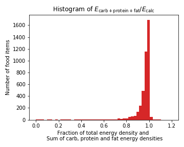

# Meal optimizer based on Finelli's data

## Aim

Optimize a seven day meal plan containing **as little sugar as possible**
with following constraints:

1. Total calories per day should be as close to 2000 kcal as possible. Energy division by macronutrients, as accurately as possible:
    * 50 % of energy should be from carbs
    * 30 % from proteins
    * 20 % from fat
2. At least 20 g of fiber per day
3. At most 500 g of a single food item per day
4. No items from the same food group (e.g. “cake” or “cheese”) on successive days
5. At least 3 different food groups need to be chosen for every day

Since I like more SI units, the first constraint is changed so that we aim to 2000 kcal * 4.184 kJ/kcal = 8368 kJ.

## How to run

```bash
make run
```

This will build a docker image and run it:

```bash
docker build --tag=meal_optimizer_rvaananen .
mkdir -p results
docker run -v `pwd`/results:/results --rm meal_optimizer_rvaananen
```

## Solution

The problem can be solved with a linear programmer solver. I use a python library named `Pulp`.

The following pre-process steps are taken:

1. Select only the columns needed
2. Transform numeric columns to numeric values, fill '< something' values with 0.
3. Set total energy density io a food item to have a minimum limit. When including zero energy foods the solver somehow messes with the food groups. Also I chose to select only foods with more energy than 10 kJ/100 g -> no need to eat 500 g salt.
4. Amounts of carbs, proteins and fats are given in mass density. Transform these into energy density (kj/100 g).


## Output

The results are printed to stdout, as well as they can be found from file `./results/results.json`.

The constraint that bans successive days having common food groups, makes the optimal meal combo alternate between two versions, ie. day1==day3==day5 etc and day2==day4==day6 etc.

The meal of the first day is:

| name |  portion/100g|
|----|---|
| Oat Gruel, Oat Flakes, Water, Salt | 5.0|
|  Rice, Long-Grain, Boiled, Meat Bouillon | 5.0|
|            Chicken Drumstick With Skin, Raw | 5.0|
|                    Maize Porridge, Polenta | 3.5|
|            White Bread, Wheat Roll, Water | 1.4|
|                    Cod, Boiled Without Salt | 1.0|
| Vegetable Fat Spread 38%, Becel Light Olive | 0.2|
|                             Psyllium Husks | 0.1|


Foodgroups

* {'cod', 'vegetable_fat_spread_38%', 'chicken_drumstick_with_skin', 'psyllium_husks', 'maize_porridge', 'white_bread', 'rice', 'oat_gruel'}

And for the second day:

|                                              name   |portion /100g|
|---|----|
|                    Millet Porridge, Water, Salt | 5.0|
|             Rice Porridge, Water, Without Salt | 5.0|
|   Sport Beverage, Protein Drink, Pro Fx Zero Carb | 5.0|
| Sport Beverage, Protein Drink, Average Of Prod... | 5.0|
|           Cocoa, Hot Chocolate, Sugar-Free, Water | 5.0|
|                    Rice And Rye Mix, Boiled, Salt | 4.9|
|                                Fish, Fatty, Smoked | 1.3|
|     Cheese, Semi-Hard Cheese, 10% Fat, Valio Polar | 0.9|
|  Barley Porridge, Pearl Barley, Water, Without ... | 0.7|
|                                         Rice Starch | 0.03|

Foodgroups

* {'fish', 'rice_starch', 'millet_porridge', 'barley_porridge', 'rice_porridge', 'cocoa', 'cheese', 'sport_beverage', 'rice_and_rye_mix'}

Both meals meet the requirements very accurately:

|Constraints | Value | Target value |
| ---|----|-- |
|Total energy of the meal| 8367.3 kJ |8368.0 kJ|
|Energy from carbs       | 50.0 % |50.0 %|
|Energy from protein     | 30.0 % |30.0 %|
|Energy from fats        | 20.0 % |20.0 %|
|Total fibre of the meal | 20.0 g |>=20 g |

The format of the results.json file is as following :

```json
 {
    "day0": {
        "0": {
            "id": 11507,
            "name": "Rice Starch",
            "portion": 0.02884152
        },
        "1": {
            "id": 1375,
            "name": "Rice And Rye Mix, Boiled, Salt",
            "portion": 4.9150586
        },

```

Where for each day there are N pieces of food items. For each food item, `id` refers the food item `id` from Finelli database. `Name` refers the name column in the database and `portion` refers the optimal amount of food item to consume for a healty meal (in 100 g).


### Energy densities of carbs, fats and proteins

The first three constraits are easy to implement with `Pulp`. However the data gives macronutrient values as mass density, whereas we want to express them as energy density. Wikipedia (https://en.wikipedia.org/wiki/Food_energy) tells us the conversion factors:

- Carbohydrate 17 kJ/g
- Protein 17 kJ7/g
- Fat 37 kJ/g.

(see also below the section /Restrictions & assumptions/)

### Food group

For the 4th and 5th constraint, we need a food group. The food name is apparently a free text field, and although the names have some systematic manner, the task is not a trivial one. Here we have implemented two very simple rules to form the groups:

1. Take the first word of the name, or
2. Take the first part of the name before first comma.

Neither of these method are sophisticated, but they can be used to test the meal optimizer. In the above solution the version 2 is used. 

As variables to optimize, the values of each food item (connected to the 'id' column as food idenfier) as well as the unique food groups were used. The first ones were defined to be non-negative and continous. The latter ones were defined to be 0/1-integers, as they are indicator variables if the group is included or not.

To tie the food items and food groups a trick was needed:

```python
    # Here the food items and food groups are connected:
    # The first constrain ensures that the food items from chosen food group are chosen.
    # The second one ensures that if the food group is not chosen 
    # then corresponding food items are not chosen.
    # Notice that this brings positive (1e-5) value for
    # all food items from selected food group. 
    # Later we filter out the foods where value is below 1.1*1e-5
    for f in food_items:
        prob += food_vars[f]>= food_group_chosen[food_group[f]]*1e-5
        prob += food_vars[f]<= food_group_chosen[food_group[f]]*1e5
```

### Successive days

To prevent successive days to contain same food groups, a new available set of food items is formed after every day. Then all the food items, that belong to the food groups that were used, are removed from the data. The optimization is perfomed normally, but the different input set of food items gives a different solution.  

## Restrictions & assumptions

The main assumption here is that the protein, fat and carb mass densities can be transformed to energy densities using universal factors. This is not actually true, as we see when comparing the sum of these energy components and the column 'Energy, calculated'. The following two plots to demonstrate the situation. They both show that there is a considarable amount of food items where the total calculated energy (from Finelli's table) is larger than the sum of the components.

 

## Todo/Improvements

* Read the constraints from a file. Allow also user choose between the food group definition.
* Divide the foods into groups by more clever way.
* Put a treshold how well the total energy density must equal to the sum of the carb, fat and protein energy densities. Or find another way to make them meet. This could include studying the distributions of each of these energy densities and filtering out ouliers.
* (Partly ok) Rewrite output file so that it would be easier to read. (put food items to order, format json)
